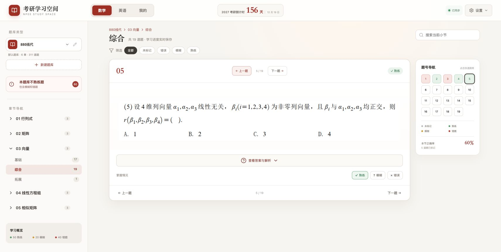
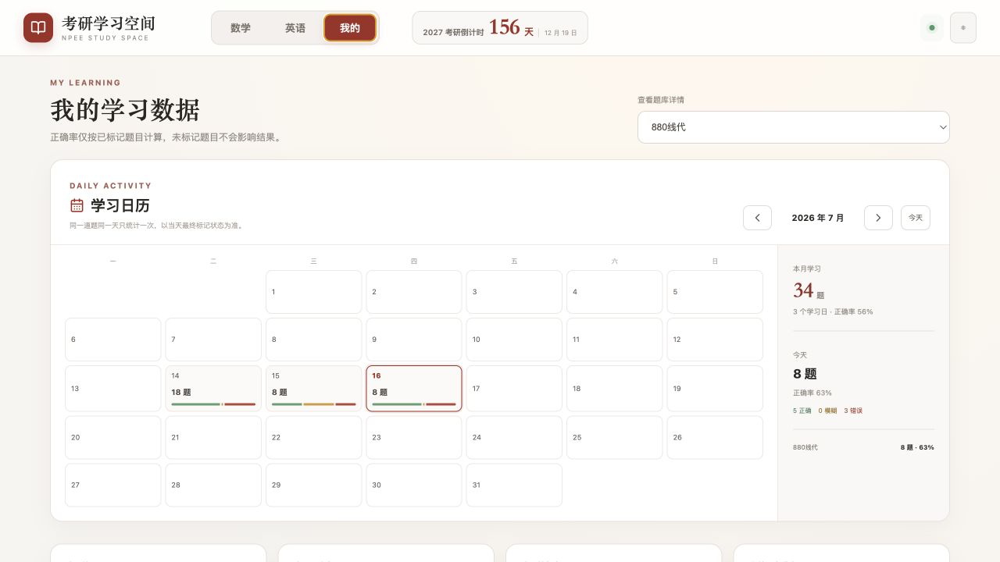
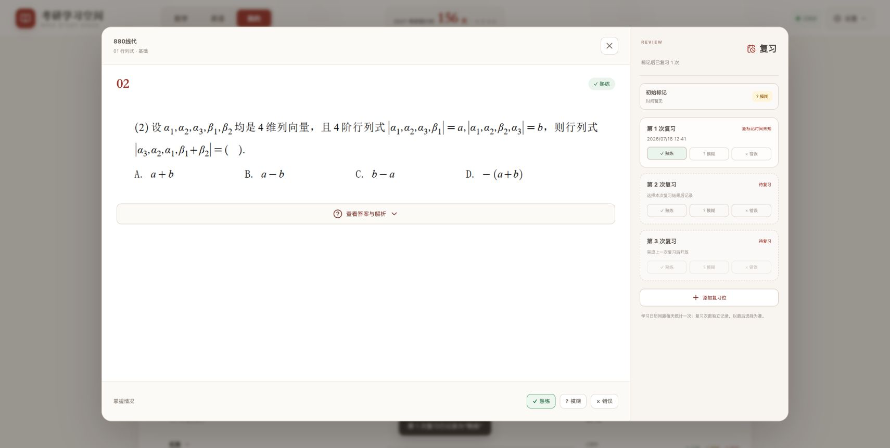

# 考研学习空间

本地优先的考研题库、错题复盘与学习进度工具。它把数学图片题库、2004–2026 年英语一真题、每日学习记录和多轮复习放在同一个界面中；无需注册账号，题库与学习数据默认保存在自己的电脑上。

当前默认内置 **10 个题库、4122 道题**。英语真题按“年份 → 题型”组织，数学图片题按“章节 → 小节 → 题号”组织；题库内容与个人学习记录分开存储，更新题库不会覆盖熟练度和复习历史。

## 界面预览

### 题目学习

章节导航、题号状态、答案解析和熟练度标记集中在一个学习界面，上一题/下一题切换不会打断当前进度。



### 学习看板

日历按天汇总练习数量、正确率与待复盘题目，并进一步展示题库、章节和小节进度。



### 分次复习

题目弹窗区分“初始标记”和“第 N 次复习”，显示每次复习时间以及距初始标记、距上次复习的间隔。



## 启动

### 一键启动

- macOS：双击 `一键启动.command`（自动配置 Homebrew、Node.js、pnpm 和项目依赖）
- Windows：双击 `一键启动.bat`（通过 winget 自动配置 Node.js、pnpm 和项目依赖）

首次启动需要联网，macOS 安装 Homebrew 时可能要求输入系统密码。配置完成后会自动打开浏览器；以后双击通常可以直接启动。也可以使用命令行：

```bash
pnpm install
pnpm start
```

启动后可在终端输入 `R` 并回车重启服务，输入 `Q` 并回车安全关闭服务。开发时仍可使用 `pnpm dev` 直接运行 Vite。

生产构建：

```bash
pnpm build
pnpm preview
```

## 核心功能

| 模块 | 能力 |
| --- | --- |
| 题库学习 | 多题库、章节、小节切换；选择题、填空题、解答题和多图题展示；题号导航与上下题切换 |
| 掌握标记 | 熟练、模糊、错误三档标记；再次点击可取消；所有变化自动持久化 |
| 分次复习 | 初始标记与复习次数分开计数；记录复习时间和间隔；当天最新复习可修改或取消 |
| 学习看板 | 每日学习日历、正确率、待复盘数量、题库/章节/小节进度与掌握分布 |
| 错题复盘 | 跨题库汇总模糊与错误题；一键重练；掌握后自动移出当前复盘列表 |
| 搜索筛选 | 当前小节全文搜索；按未标记、熟练、模糊、错误筛选 |
| 图片题库 | 选择目录批量导入题目与答案图片；支持一题多图和重复导入覆盖 |
| 导出打印 | 按题库/章/节/状态筛选；每页 1 或 2 题；打印、另存 PDF、复制原图 |
| 数据管理 | 本地工作区同步、JSON 完整备份、多轮学习记录、题库与用户数据隔离 |
| 多端布局 | 桌面端完整双栏学习体验，平板与手机端自适应滚动和复习卡片布局 |

## 复习规则

1. 第一次选择熟练度时生成“初始标记”，不计入复习次数。
2. 后续在复习卡片中选择状态，依次生成“第 1 次复习”“第 2 次复习”等记录。
3. 初始标记和第一次复习即使发生在同一天，也会作为两条独立记录保存。
4. 当天最后一次复习可以改选；再次点击已选状态可取消，取消后恢复到复习前的熟练度。
5. 默认展示 3 个复习位；超过 3 次可手动添加，额外添加且尚未使用的复习位可以删除。
6. 历史日期的复习记录只读，避免误改过去的学习轨迹。

## 导入格式

可以导入单纯的题库数组，或含 `banks` 字段的备份文件。最小格式：

```json
{
  "banks": [{
    "id": "my-bank",
    "name": "我的强化题库",
    "source": "local",
    "chapters": [{
      "id": "chapter-1",
      "name": "第一章",
      "sections": [{
        "id": "section-1",
        "name": "选择题",
        "questions": [{
          "id": "question-1",
          "number": 1,
          "type": "选择题",
          "text": "题目正文",
          "options": ["A. 选项一", "B. 选项二"],
          "answer": "A",
          "analysis": "解析正文"
        }]
      }]
    }]
  }]
}
```

题目还支持 `imageUrl`、`answerImageUrl`、`imageKeys`、`answerImageKeys` 和 `videoUrl`。导入同 ID 题库时，新数据会替换旧数据；学习状态会继续保留。

`type` 为可选字段：需要显示“选择题”“填空题”等标签时填写，不需要题型标注时可以直接省略。通过图片目录自动创建的题目默认不添加题型标签。

## 批量导入图片

点击顶部“图片”，选择一个包含图片的目录。系统严格按照统一文件名自动建立并匹配题目，可一次导入大量文件。Q/A 后依次为章号、小节号和题号：

```text
Q-01-1-01.png           单张题目图
Q-01-1-01.1.png         多图题目的第 1 张
Q-01-1-01.2.png         多图题目的第 2 张
A-01-1-01.png           单张答案图
A-01-1-01.1.png         多张答案中的第 1 张
A-01-1-01.2.png         多张答案中的第 2 张
```

如果图片放在 `01 行列式 1-基础` 普通文件夹中，还会自动把章节命名为“行列式”，小节命名为“基础”。点号后的分片序号没有固定上限。未按上述标准命名的文件会被安全跳过，再次导入同名文件会覆盖原图片。

## 数据说明

### 题库文件夹工作区（推荐）

使用最新版 Chrome 或 Edge，点击顶部“文件夹”，选择一个本地目录并授权读写。应用会扫描每个一级子文件夹作为一个题库。题库结构、重命名和目录映射写入 `题库数据.json`，学习标记、每日记录和用户设置单独写入 `用户数据.json`，项目数据与用户数据互不混合。

项目已经自带 [`默认题库`](./默认题库) 目录。一键启动后会自动连接并扫描该目录，无需手动选择或授予浏览器文件夹权限。只有切换到项目外的其他题库目录时，才需要在浏览器中进行一次授权。

```text
默认题库/
├── 题库数据.json
├── 880线代/
│   └── 01 行列式 1-基础/
│       ├── Q-01-1-01.1.png
│       └── Q-01-1-01.2.png
└── 英语一真题/
    ├── 2004年考研英语真题/
    ├── ...
    └── 2026年考研英语一真题/

用户数据/
└── 用户数据.json
```

- 一级子文件夹名称用于首次创建题库，后续以 `题库数据.json` 中的映射为准。
- 网页重命名会更新清单中的显示名称，不会强制重命名磁盘文件夹。
- 考试日期、当前学习轮次等用户设置保存在 `用户数据.json` 的 `settings` 字段；旧版浏览器设置会一次性迁移，成功后自动清理旧键。
- 学习标记和每日做题记录按轮次保存在 `用户数据.json` 的 `rounds` 字段；原有记录会自动归入第 1 轮，默认预设 5 轮，可在设置中继续新增。
- 将新图片复制进工作区后，点击顶部“已连接”重新扫描即可导入；网页内的重命名和题库修改写回题库清单，学习标记写回独立用户数据文件。
- 项目外的自选工作区会在同一根目录生成两个相互独立的文件：`题库数据.json` 与 `用户数据.json`。
- 旧版 `题库数据.json` 中的 `statuses` 字段仍可读取，连接后会迁移到新版用户数据并在后续写入中移除旧字段。
- 浏览器首次必须由用户选择并授权文件夹，这是浏览器的安全要求；授权记录会保存在当前浏览器中。
- Safari/Firefox 暂不支持目录写回时，仍可使用原有“图片”导入与 JSON 备份。

- 题库键：`npee:banks:v1`
- 学习轮次键：`npee:rounds:v1`（旧版状态与每日记录会合并迁移到第 1 轮，成功后删除旧键和空轮次）
- 用户设置键：`npee:settings:v1`
- 图片素材：浏览器 IndexedDB 数据库 `npee-question-assets`
- 点击设置中的“完整备份”可导出题库、全部学习轮次和用户设置。
- 图片不存进 `localStorage`，支持远高于普通 JSON 缓存的容量；实际配额由浏览器和磁盘空间决定。
- JSON 备份包含题库结构、各轮学习状态、各轮每日记录和用户设置，不包含 IndexedDB 中的图片 Blob。
- 清除浏览器站点数据会删除本地内容和图片，请保留原始图片目录并定期备份 JSON。

## 浏览器兼容性

- **推荐：Chrome / Edge 最新版。** 支持目录选择、题库文件写回和默认工作区自动同步。
- Safari / Firefox 可以学习、标记、导入 JSON 和使用浏览器本地缓存，但不能完整使用文件夹实时写回。
- 手机浏览器适合查看题目、标记与复习；批量图片导入和工作区维护建议在桌面端完成。

## 项目结构

```text
NPEElearningtool/
├── src/                  React 界面、状态管理和测试
├── scripts/              一键启动与默认工作区服务
├── docs/screenshots/     README 界面截图
├── 默认题库/             题库清单与原始图片
├── 用户数据/             用户数据格式说明与本地数据文件
├── 一键启动.command      macOS 启动入口
└── 一键启动.bat          Windows 启动入口
```

## 开发与验证

```bash
pnpm install      # 安装依赖
pnpm dev          # 启动开发服务器
pnpm test         # 运行全部单元测试
pnpm build        # 类型检查并生成生产构建
pnpm preview      # 本地预览生产构建
```

发布前建议至少运行 `pnpm test` 与 `pnpm build`，并在桌面和手机宽度下检查题目学习、答案展开、熟练度撤销、学习看板和复习弹窗。
