# 考研学习空间 · NPEE Study Space

[](https://github.com/EnderRayven/NPEElearningtool/releases/latest)
[](https://github.com/EnderRayven/NPEElearningtool/actions/workflows/release.yml)
[](#下载与启动)

一个本地优先、无需注册的考研题库、错题复盘与学习进度工具。它把数学、专业课图片题库、2004–2026 年英语一真题、每日学习记录、题目笔记和多轮复习放在同一个清爽界面中；题库与学习数据默认保存在自己的电脑上。

当前默认内置 **22 个题库、7212 道题**。英语真题按“年份 → 题型”组织，数学和专业课图片题按“章节 → 小节 → 题号”组织；题库内容与个人学习记录分开存储，更新题库不会覆盖熟练度和复习历史。

> 当前正式版：**v0.4.8** · 本地优先 · 无需注册 · 支持 macOS / Windows · 推荐 Chrome / Edge

[**下载 v0.4.8 软件包**](https://github.com/EnderRayven/NPEElearningtool/releases/download/v0.4.8/NPEE-Study-Space-v0.4.8-Software.zip) · [下载 v0.4.8 题库数据](https://github.com/EnderRayven/NPEElearningtool/releases/download/v0.4.8/NPEE-Study-Space-v0.4.8-Question-Bank.zip) · [查看 Release 说明](https://github.com/EnderRayven/NPEElearningtool/releases/tag/v0.4.8) · [反馈问题](https://github.com/EnderRayven/NPEElearningtool/issues)

软件包与题库数据分开发布：软件包包含应用源码、启动脚本和运行所需配置，不包含默认题库图片；题库数据包包含 `数据/` 目录，其中集中放置题库和用户数据。首次使用时，将两个压缩包解压到同一个目录，再运行对应系统的一键启动脚本；后续更新软件或题库时可以单独替换对应包。无需安装 Git 或克隆仓库。

## 快速导航

- [界面预览](#界面预览)：查看学习、看板和复习界面
- [功能图谱](#功能图谱)：用截图快速了解每个主要模块
- [下载与启动](#下载与启动)：下载软件包和题库数据并一键启动
- [典型学习流程](#典型学习流程)：从选题库到多轮复习
- [核心功能](#核心功能)：完整能力总览
- [默认题库](#默认题库)：内置题库及题目数量
- [导入自己的题库](#导入格式)：JSON 与图片目录规范
- [数据保存](#数据说明)：题库、学习记录与备份位置
- [开发与验证](#开发与验证)：本地开发和测试命令

## 适合哪些场景

- **按教材刷题：** 用题库、章节、小节三级结构保持学习顺序，随时按状态筛题。
- **图片题整理：** 直接导入扫描题、讲义截图和多张解析图，不必逐题手工录入正文。
- **错题复盘：** 将模糊、错误题集中到复盘入口，掌握后自动退出当前错题列表。
- **长期进度跟踪：** 用日历查看每天做题量、正确率和待复盘数量，用多轮数据区分一刷、二刷。
- **离线与隐私优先：** 不需要账号或云数据库，适合保存个人购买资料和学习记录。

## 界面预览

| 学习任务 | 主要入口 | 系统会记录什么 |
| --- | --- | --- |
| 刷数学或专业课图片题 | 顶部“数学 / 专业课”与左侧章节树 | 熟练度、答题日期、当前题号、题目笔记和复习记录 |
| 做英语一历年真题 | 顶部“英语”与年份/题型分组 | 正确/错误状态、阅读题型、全卷进度和每日活动 |
| 集中复盘错题 | 左侧“不熟练题”或“我的”页面 | 初始标记、每次复习结果、复习时间与间隔 |
| 查看长期进度 | 顶部“我的” | 每日题量、正确率、待复盘数量以及题库/章节/小节进度 |
| 迁移或维护数据 | 顶部“设置” | 独立用户数据、学习轮次、完整备份和本地工作区同步状态 |
| 整理纸质练习 | 设置 → 导出题目 | 按范围、掌握状态和每页题数生成 PDF，或复制原图到文件夹 |

### 功能图谱

下面的截图均来自当前应用界面；可以点击图片放大查看，后文按功能展开说明。

<table>
<tr>
<td>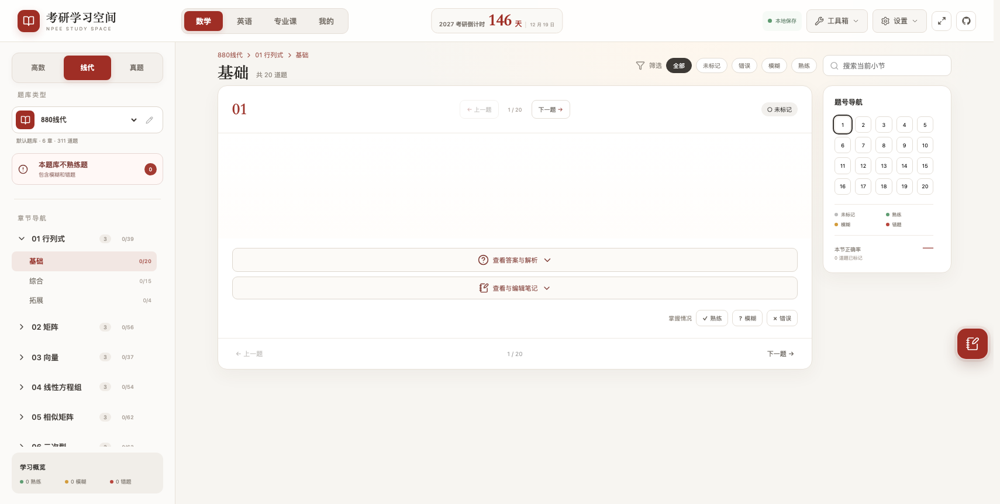<br><sub>英语真题学习：章节、题目与全卷导航</sub></td>
<td>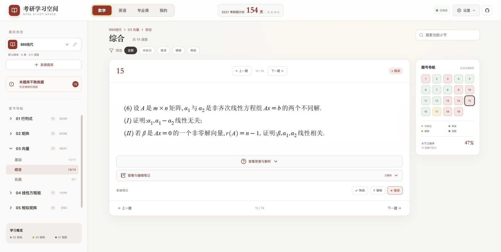<br><sub>图片题学习：原图、解析图与状态筛选</sub></td>
<td>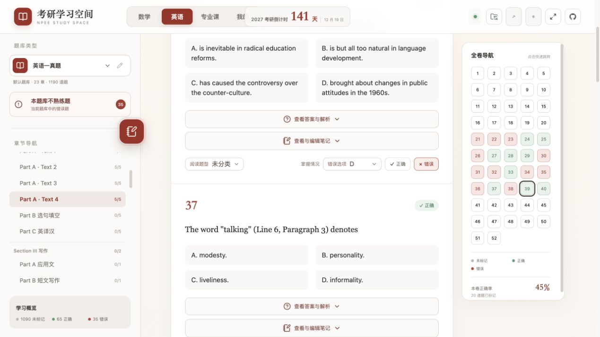<br><sub>英语错题：阅读题型与具体错误选项</sub></td>
</tr>
<tr>
<td><br><sub>题目笔记：文字笔记与手写笔记</sub></td>
<td>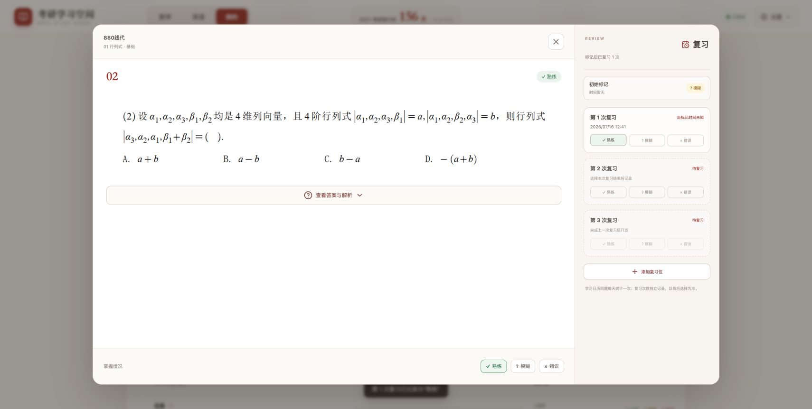<br><sub>分次复习：初始标记与复习时间线</sub></td>
<td>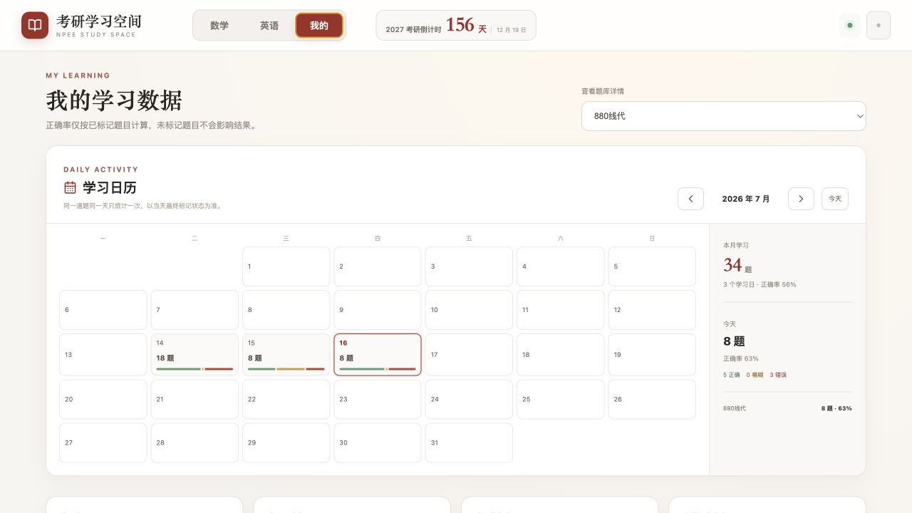<br><sub>学习看板：日历、正确率与层级进度</sub></td>
</tr>
<tr>
<td>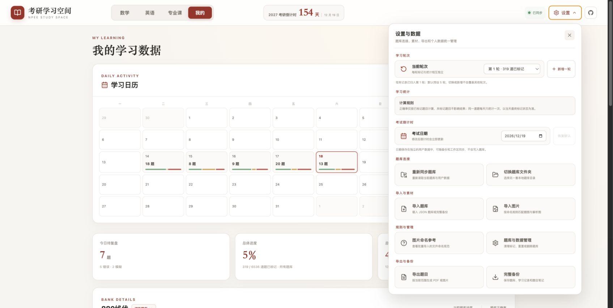<br><sub>设置与数据：轮次、同步、导入与备份</sub></td>
<td>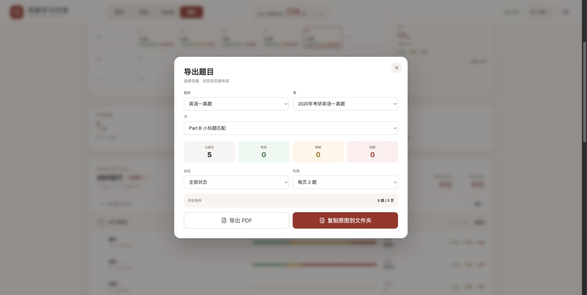<br><sub>导出打印：按范围筛选并生成 PDF</sub></td>
<td>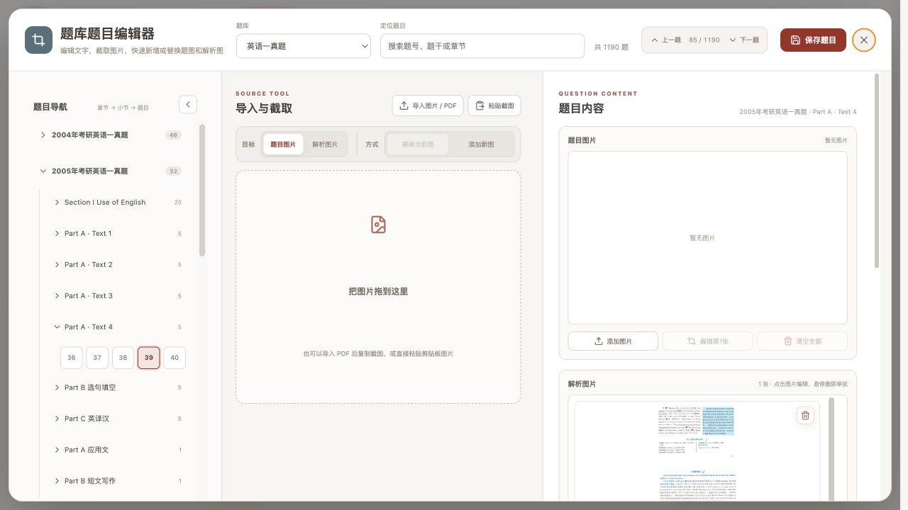<br><sub>题目编辑器：文字、题图与解析图维护</sub></td>
</tr>
<tr>
<td>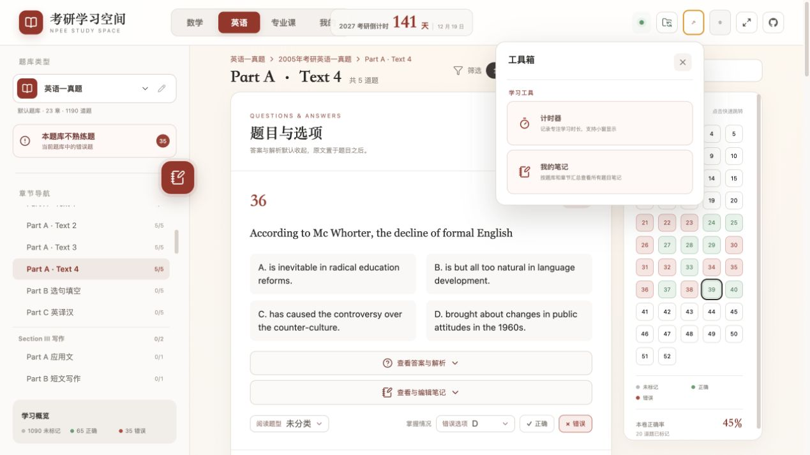<br><sub>工具箱：计时器与我的笔记入口</sub></td>
<td><br><sub>计时器：秒表、倒计时与快速预设</sub></td>
<td>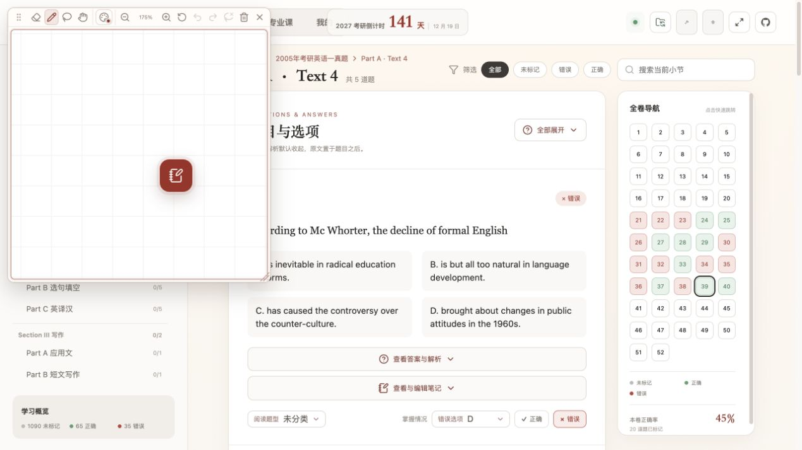<br><sub>草稿本：独立画布、套索与缩放</sub></td>
</tr>
</table>

### 英语真题学习

年份、题型、题目、备选项、原文、答案解析和全卷导航集中在一个学习界面；阅读理解还支持按年份切换独立 Text 文章，题号跳转会同步进入对应原文。


> 截图展示当前学习界面；题目编辑器与分类设置面板可从顶部“设置”入口打开。

图中主要区域：

1. **左侧年份与题型导航：** 按“年份 → Section → 题型”切换，实时显示每组已标记题量。
2. **中间真题内容：** 保留原题排版，支持共享备选项、长文、单图、多图和独立答案解析。
3. **题目状态：** 英语使用正确/错误两档，数学和专业课使用熟练/模糊/错误三档；再次点击即可撤销。
4. **右侧全卷导航：** 一眼查看整张试卷 1–52 题状态；阅读专题模式下按年份与 Text 文章独立显示题号，点击题号会进入对应文章。
5. **搜索与筛选：** 可以只看未标记、错误、模糊或熟练题，也能搜索当前小节内容。

英语阅读客观题还可以单独记录阅读题型和具体错误选项，便于复盘“错在什么选项”，而不是只保留一个错误状态。

### 数学与专业课图片题

扫描题、讲义截图和多张解析图可以直接作为题目素材使用，不需要先做 OCR，也不必逐题重新排版。


- 左侧按题库、章节和小节组织大量图片题，并在每一级显示已标记/总题数。
- 中间题目区按原图比例自适应展示，兼容单张题图、一题多图、单张答案和多张解析。
- 顶部与底部都提供上一题/下一题，长题看完后无需滚回页面顶部。
- 右侧题号颜色对应未标记、熟练、模糊和错题，当前题使用描边强调。
- 当前小节正确率只按已标记题目计算；再次点击已选状态可以撤销，避免误操作污染统计。

### 题目编辑器与素材截取

从“设置 → 题库与数据 → 编辑题目与图片”进入题目编辑器，可直接维护题目文字与图片素材。


- **快速定位：** 按题号、题干或章节搜索，左侧按“章节 → 小节 → 题目”导航。
- **图片来源：** 支持导入图片/PDF、粘贴剪贴板截图和拖拽素材。
- **图片处理：** 支持裁剪、旋转、矩形填充，以及题图/解析图的新增、替换、删除。
- **文字字段：** 可编辑题号、题型、考点、题干、选项、答案和文字解析。
- **安全保存：** 保存后写回当前本地题库；题库内容与个人熟练度、复习历史仍然分开保存。

### 题目笔记与手写

每一道题都有独立笔记，不需要离开学习页切换到其他笔记软件；内容会跟随完整备份和工作区用户数据保存。


- **文字笔记：** 适合记录公式、易错点、解题顺序和下次复习提醒，输入后自动保存。
- **手写笔记：** 支持画笔、橡皮、撤销、重做和清空，可放大到全屏书写。
- **形状编辑：** 支持直线、箭头、矩形、圆形和三角形；选中形状后可修改线形、填充、填充颜色和透明度。
- **保存提示：** 按钮会显示“已保存”，笔记面板也会反馈自动保存状态。
- **题目隔离：** 每题使用独立 ID 保存笔记，切换题库、章节或学习轮次不会串题。
- **备份迁移：** 文字与矢量手写内容会进入完整 JSON 备份；原始题图仍按文件夹单独保存。

### 学习看板

日历按天汇总练习数量、正确率与待复盘题目，并进一步展示题库、章节和小节进度。


学习看板不会只展示一个总百分比，而是从多个层级解释当前进度：

- 日历中的每一天显示练习题数与三种掌握状态的比例。
- 右侧摘要显示当天正确率、熟练/模糊/错误数量以及涉及题库。
- 指标卡汇总今日练习、今日正确率、今日待复盘和当前题库完成度。
- 题库详情继续下钻到章节和小节，方便定位“做得少”或“错误率高”的部分。
- 同一道题当天多次改选只计一次，以当天最后状态参与日历统计。

### 分次复习

题目弹窗区分“初始标记”和“第 N 次复习”，显示每次复习时间以及距初始标记、距上次复习的间隔。


复习侧栏与题目内容并排显示，查看解析后无需离开弹窗即可完成本次复习：

- “初始标记”保存第一次判断结果，不占用复习次数。
- 每张复习卡显示序号、结果、记录时间和两种时间间隔。
- 当前可操作卡片支持熟练、模糊、错误三种结果；再次点击已选结果即可取消。
- 当天最新记录允许调整，历史日期记录只读，避免误改既往轨迹。
- 默认预留 3 次复习；需要更多轮次时可以继续添加复习位。

### 设置、同步与完整备份

顶部“设置”把学习轮次、考试倒计时、题库连接、导入、导出和数据管理集中在一个面板中；右侧的小型 GitHub 图标可直接打开项目主页。


- **学习轮次：** 默认预设 5 轮，也可继续新增；每一轮的标记、活动与统计彼此独立。
- **考试倒计时：** 可以覆盖默认考试日期，日期会写入独立用户设置并参与同步与备份。
- **题库文件夹：** 重新同步当前工作区，或切换到另一套本地题库；题库内容与个人记录分开写入。
- **导入与素材：** 支持载入 JSON 题库/完整备份，也能按统一命名批量匹配题图和答案图。
- **完整备份：** 一次导出题库结构、全部轮次、熟练度、每日活动、复习时间线、设置与题目笔记。
- **安全管理：** 清理标记、重置题库、删除自建题库和恢复出厂均提供明确的作用范围与确认步骤。

### 工具箱、计时器与草稿本

工具箱集中提供计时器、倒计时、我的笔记和全屏入口；右下角草稿本适合在做题过程中临时演算，不会混入题目笔记。

| 工具箱 | 计时器 | 草稿本 |
| --- | --- | --- |
|  |  |  |

- **秒表计时器：** 记录专注时长，可暂停、继续和结束；已结束的学习片段会进入历史记录。
- **专注倒计时：** 默认 5 分钟，可随时暂停、重置或重新开始；关闭弹窗不会中断正在运行的倒计时。
- **草稿本缩放：** 点击百分比可选择 35%–320% 的常用比例，或输入自定义值；缩放以画布中心为基准。
- **手写协作：** 草稿本和题目笔记支持笔迹复制粘贴、套索选中和批量改色，触控笔可直接拖动页面滚动。

### 按范围导出与打印

导出窗口适合制作纸质错题集、阶段练习和章节复盘材料，筛选结果与预计页数会在导出前即时计算。


- 依次选择题库、章、节和掌握状态，可只导出错题、模糊题、未标记题或熟练题。
- 页面布局支持每页 1 题或 2 题，并在导出前显示“符合条件题数 / 预计页数”。
- “导出 PDF”调用浏览器打印预览，可以继续选择打印机或另存为 PDF。
- “复制原图到文件夹”适合把扫描题整理到独立目录，保留原始清晰度，不经过页面截图压缩。
- 题图与答案图会等待加载完成后再进入打印流程，降低空白页或图片缺失的概率。

## 典型学习流程

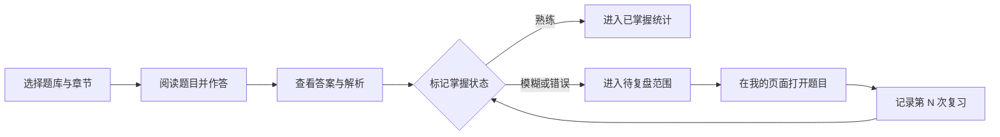
```mermaid
flowchart LR
    A[选择题库与章节] --> B[阅读题目并作答]
    B --> C[查看答案与解析]
    C --> D{标记掌握状态}
    D -->|熟练| E[进入已掌握统计]
    D -->|模糊或错误| F[进入待复盘范围]
    F --> G[在我的页面打开题目]
    G --> H[记录第 N 次复习]
    H --> D
```

推荐用法：

1. 从“数学”或“英语”进入目标题库，选择当前计划学习的小节。
2. 做完题后再展开答案与解析，根据真实掌握程度选择熟练、模糊或错误。
3. 每天在“我的”页面查看日历和待复盘数量，优先处理错误题，再处理模糊题。
4. 从章节进度中点击题号打开复习弹窗，把复习结果记录到独立时间线。
5. 完成一轮后在设置中切换到下一学习轮次；旧轮次的标记和统计会完整保留。

## 下载与启动

### 一键启动

1. 在同一个 [v0.4.8 Release](https://github.com/EnderRayven/NPEElearningtool/releases/tag/v0.4.8) 中分别下载 `NPEE-Study-Space-v0.4.8-Software.zip` 和 `NPEE-Study-Space-v0.4.8-Question-Bank.zip`。
2. 将两个压缩包解压到同一个可长期保存的目录，使 `数据/` 与 `一键启动.command` 或 `一键启动.bat` 位于同一级；不要直接在压缩包预览中运行。
3. 按系统启动：
   - macOS：优先打开 Release 中带有 `.dmg` 的已签名封装版；如果下载的是未签名备用 `.dmg`，先拖入 `Applications`，再双击其中的 `解除隔离并启动.command`；如果使用软件源码包，双击 `一键启动.command`，自动配置 Homebrew、Node.js、pnpm 和项目依赖。
   - Windows：双击 `一键启动.bat`，通过 winget 自动配置 Node.js、pnpm 和项目依赖。

软件包首次启动需要联网安装 Node.js 22.13+、pnpm 和项目依赖；macOS 安装 Homebrew 时可能要求输入系统密码。配置完成后会自动打开浏览器；以后双击通常可以直接启动。也可以使用命令行：

如果 macOS 弹出“应用已损坏，无法打开”，通常是旧版未签名封装包被 Chrome 隔离，并非题库损坏。请确认应用来自本项目 Release，然后按以下顺序操作：先把 `.dmg` 中的 `NPEE Study Space.app` 拖到 `Applications`，再双击 DMG 中的 `解除隔离并启动.command`。脚本会优先处理 `/Applications` 中的可写副本，移除下载隔离并启动应用。只需执行一次，之后通常可以直接打开应用。

如果你只下载了 `.dmg` 或 `.app`，也可以从软件源码包中取出这个 `.command` 文件，与应用放在同一目录后双击。该命令只适用于确认来自官方 Release 的应用，不会修复真正损坏或被篡改的文件。

如果 macOS 第一次阻止打开这个命令文件，请在 Finder 中右键点击它，选择“打开”，再在提示框中确认“打开”。

```bash
pnpm install
pnpm start
```

本地网页版固定使用 `http://localhost:45217/`，与 Electron 版共用 OneDrive 回调地址；正式部署到公网时使用部署后的 HTTPS 地址。

启动后可在终端输入 `R` 并回车重启服务，输入 `Q` 并回车安全关闭服务。开发时仍可使用 `pnpm dev` 直接运行 Vite。

生产构建：

```bash
pnpm build
pnpm preview
```

## 核心功能

| 模块 | 能力 |
| --- | --- |
| 题库学习 | 多题库、章节、小节切换；选择题、填空题、解答题和多图题展示；题号导航与上下题切换 |
| 英语真题 | 2004–2026 年英语一；年份/Section/题型与阅读 Text 专题分组；完形、阅读、新题型、翻译与写作专用排版；全卷 1–52 题导航 |
| 掌握标记 | 数学和专业课使用熟练/模糊/错误三档，英语使用正确/错误两档；再次点击可取消；变化自动持久化 |
| 分次复习 | 初始标记与复习次数分开计数；记录复习时间和间隔；当天最新复习可修改或取消 |
| 题目笔记 | 每题支持自动保存的文字笔记与可编辑手写；手写支持画笔、橡皮、形状样式、撤销和重做，并可放大到全屏 |
| 学习看板 | 每日学习日历、正确率、待复盘数量、题库/章节/小节进度与掌握分布 |
| 错题复盘 | 跨题库汇总模糊与错误题；一键重练；掌握后自动移出当前复盘列表 |
| 搜索与位置恢复 | 当前小节全文搜索；按状态筛选；分别记住数学、英语、专业课上次学习的题库、章节、小节和题号 |
| 图片题库 | 选择目录批量导入题目与答案图片；支持一题多图、无限分片、重复导入覆盖和默认工作区自动扫描 |
| 题目编辑器 | 编辑题目文字、选项、答案与解析；从 PDF、图片或剪贴板裁剪素材，并新增、替换或删除题图 |
| 导出打印 | 按题库/章/节/状态筛选；每页 1 或 2 题；打印、另存 PDF、复制原图 |
| 数据管理 | 本地工作区同步、JSON 完整备份、考试倒计时、多轮学习记录、题库与用户数据隔离 |
| 多端布局 | 桌面端完整双栏学习体验，平板与手机端自适应滚动和复习卡片布局 |

## 默认题库

| 分类 | 题库 | 题目数量 |
| --- | --- | ---: |
| 线性代数 | 880线代 | 311 |
| 线性代数 | 27基础30讲线代 | 169 |
| 高等数学 | 27基础30讲高数 | 419 |
| 高等数学 | 27数二1000A-高数 | 301 |
| 线性代数 | 27数二1000A-线代 | 106 |
| 高等数学 | 27数二1000B-高数 | 349 |
| 线性代数 | 27数二1000B-线代 | 103 |
| 线性代数 | Kira线代基础 | 165 |
| 线性代数 | Kira线代强化 | 184 |
| 高等数学 | 27张宇强化36讲高数 | 211 |
| 线性代数 | 27张宇强化36讲线代 | 87 |
| 高等数学 | 880高数 | 618 |
| 英语一 | 2004–2026 年英语一真题 | 1190 |
| 数学二 | 数学二真题 | 408 |
| 机械原理 | 讲义课后习题 | 123 |
| 机械原理 | 教材习题 | 124 |
| 机械设计 | 讲义课后习题 | 71 |
| 机械原理 | 基础过关450题 | 448 |
| 机械原理 | 强化冲关220题 | 240 |
| 机械设计 | 基础过关600题 | 647 |
| 机械设计 | 考研通关680题 | 776 |
| 机械设计 | 强化班补充讲义 | 162 |
|  | **合计** | **7212** |

默认题库只是起点。可以继续新建空题库、导入 JSON，或把自己的题目/答案图片按命名规则放入独立目录批量导入。

## 复习规则

1. 第一次选择熟练度时生成“初始标记”，不计入复习次数。
2. 后续在复习卡片中选择状态，依次生成“第 1 次复习”“第 2 次复习”等记录。
3. 初始标记和第一次复习即使发生在同一天，也会作为两条独立记录保存。
4. 当天最后一次复习可以改选；再次点击已选状态可取消，取消后恢复到复习前的熟练度。
5. 默认展示 3 个复习位；超过 3 次可手动添加，额外添加且尚未使用的复习位可以删除。
6. 历史日期的复习记录只读，避免误改过去的学习轨迹。

## 导入格式

可以导入单纯的题库数组，或含 `banks` 字段的备份文件。最小格式：

```json
{
  "banks": [{
    "id": "my-bank",
    "name": "我的强化题库",
    "source": "local",
    "chapters": [{
      "id": "chapter-1",
      "name": "第一章",
      "sections": [{
        "id": "section-1",
        "name": "选择题",
        "questions": [{
          "id": "question-1",
          "number": 1,
          "type": "选择题",
          "text": "题目正文",
          "options": ["A. 选项一", "B. 选项二"],
          "answer": "A",
          "analysis": "解析正文"
        }]
      }]
    }]
  }]
}
```

题目还支持 `imageUrl`、`answerImageUrl`、`imageKeys`、`answerImageKeys` 和 `videoUrl`。导入同 ID 题库时，新数据会替换旧数据；学习状态会继续保留。

`type` 为可选字段：需要显示“选择题”“填空题”等标签时填写，不需要题型标注时可以直接省略。通过图片目录自动创建的题目默认不添加题型标签。

## 批量导入图片

点击顶部“图片”，选择一个包含图片的目录。系统严格按照统一文件名自动建立并匹配题目，可一次导入大量文件。Q/A 后依次为章号、小节号和题号：

```text
Q-01-1-01.1.png         单张或多图题目的第 1 张
Q-01-1-01.2.png         多图题目的第 2 张
A-01-1-01.1.png         单张或多张答案中的第 1 张
A-01-1-01.2.png         多张答案中的第 2 张
```

必须使用 `01 行列式 01-基础` 这样的文件夹命名：前两位是章节号，后两位是小节号，中间的文字会直接作为章节和小节目录名称，同时保证文件夹按数字顺序排列。题图和答案图统一从 `.1.png` 开始，单张图也不再省略分片序号；点号后的分片序号没有固定上限。未按上述标准命名的文件会被安全跳过，再次导入同名文件会覆盖原图片。

## 数据说明

题库内容、个人学习记录和图片缓存采用分层保存，避免把数千张图片塞进浏览器的小容量文本存储。题库与用户数据统一放在应用文件外部的 `数据/` 目录下，网页版和 Electron 版读取同一目录即可互通：

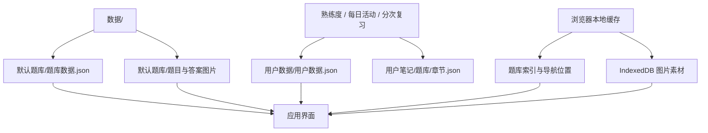
```mermaid
flowchart TD
    A[数据/] --> B[默认题库/题库数据.json]
    A --> C[默认题库/题目与答案图片]
    D[熟练度 / 每日活动 / 分次复习] --> E[用户数据/用户数据.json]
    F[浏览器本地缓存] --> G[题库索引与导航位置]
    F --> H[IndexedDB 图片素材]
    D --> J[用户笔记/题库/章节.json]
    B --> I[应用界面]
    C --> I
    E --> I
    G --> I
    H --> I
```

- `题库数据.json` 只描述题库、章节、小节、题目和文件映射。
- `用户数据.json` 保存学习轮次、熟练度、每日活动、分次复习和考试日期等个人信息；题目笔记按题库章节拆分保存到 `用户笔记/`，避免每次书写都重写全部笔记。
- 原始图片保留在题库目录；浏览器 IndexedDB 只在传统图片导入模式下缓存图片 Blob。
- “完整备份”适合迁移结构化数据；原始图片目录仍建议单独备份。

### 题库文件夹工作区（推荐）

使用最新版 Chrome 或 Edge，点击顶部“连接题库文件夹”，选择 `数据/` 文件夹并授权读写。应用会同时读取其中的 `默认题库/` 和 `用户数据/`；题库结构、重命名和目录映射写入题库侧，学习标记、每日记录和用户设置写入用户数据侧，项目数据与用户数据保持文件级分离。

项目数据位于 [`数据/`](./数据) 目录。首次使用时选择 `数据/` 文件夹；未连接前不会显示任何题库信息，但“我的”页面和本机用户设置仍可使用。

```text
考研学习空间/
├── 数据/
│   ├── 默认题库/
│   │   ├── 题库数据.json
│   │   ├── 数学/…
│   │   ├── 英语/…
│   │   └── 专业课/…
│   └── 用户数据/
│       ├── 用户数据.json
│       └── 用户笔记/
│           └── 题库编码/章节编码.json
└── 一键启动.command / macOS-解除隔离并启动.command / 一键启动.bat
```

- 数学下固定保留“高数、线代、真题”三个板块目录；英语和专业课目录下直接放具体题库。应用会根据实际文件夹自动识别题库，具体目录映射同步写入 `题库数据.json`。
- 连接 `数据/` 时会同时扫描 `默认题库/` 和 `用户数据/`；之后如需应用文件夹变化，请点击“重新同步题库”，不会持续轮询目录。
- 网页重命名会更新清单中的显示名称，不会强制重命名磁盘文件夹。
- 考试日期、当前学习轮次等用户设置保存在 `用户数据.json` 的 `settings` 字段；旧版浏览器设置会一次性迁移，成功后自动清理旧键。
- 学习标记和每日做题记录按轮次保存在 `用户数据.json` 的 `rounds` 字段；原有记录会自动归入第 1 轮，默认预设 5 轮，可在设置中继续新增。
- 将新图片复制进题库目录后，点击顶部“已同步”重新扫描即可导入；网页内的重命名和题库修改写回题库清单，学习标记和用户设置写回同一父目录下的用户数据文件。
- 题目笔记会额外写入 `用户数据/用户笔记/题库编码/章节编码.json`；题库目录不再保存用户数据或用户笔记。
- 浏览器首次必须由用户选择并授权文件夹，这是浏览器的安全要求；授权记录会保存在当前浏览器中。
- Safari/Firefox 暂不支持目录写回时，仍可使用原有“图片”导入与 JSON 备份。

### OneDrive 多端同步

设置 → 同步可以把学习轮次、熟练度、复习记录、考试日期、题目笔记和个人笔记同步到 OneDrive，供多台设备使用。当前实现只适配 OneDrive 个人账号，通过 Microsoft Graph 的 App Folder 保存数据；点击“网页登录 OneDrive”后会跳转 Microsoft 登录页，授权完成后自动回到本应用。

配置步骤：

1. 创建 Microsoft Entra 应用注册，选择 **Single-page application (SPA)** 平台，并添加网页部署地址和桌面版 `http://localhost:45217/` 重定向地址。
2. 将客户端 ID 写入构建环境变量 `VITE_ONEDRIVE_CLIENT_ID`（可参考 `.env.example`）；用户不需要在设置页面手动填写。
3. 构建并打开应用，在“设置 → 同步”点击“网页登录 OneDrive”，完成 Microsoft 授权后点击“立即同步”；另一台设备打开同一版本应用并登录同一个 Microsoft 账号即可读取数据。

当前版本默认只同步用户数据和笔记；勾选“同步题库”后会额外同步题库 JSON、题目图片和答案图片。同步设置支持关闭或按 5/15/30/60 分钟自动运行，也支持启动后延迟运行一次，并可显示和重置上次成功同步时间。授权令牌保存在本机浏览器，关闭页面后仍可继续同步，退出登录会清除令牌。题库图片按文件摘要增量同步，冲突图片会保留在 OneDrive 的 `sync/conflicts/` 中。

- 题库键：`npee:banks:v1`
- 学习轮次键：`npee:rounds:v1`（旧版状态与每日记录会合并迁移到第 1 轮，成功后删除旧键和空轮次）
- 用户设置键：`npee:settings:v1`
- 图片素材：浏览器 IndexedDB 数据库 `npee-question-assets`
- 点击设置中的“完整备份”可导出题库、全部学习轮次和用户设置。
- 图片不存进 `localStorage`，支持远高于普通 JSON 缓存的容量；实际配额由浏览器和磁盘空间决定。
- JSON 备份包含题库结构、各轮学习状态、各轮每日记录、文字/矢量手写笔记和用户设置，不包含 IndexedDB 中的图片 Blob。
- 清除浏览器站点数据会删除本地内容和图片，请保留原始图片目录并定期备份 JSON。

## 常见问题

### 为什么选择文件夹后不能写回？

文件夹实时同步依赖 File System Access API，请使用最新版 Chrome 或 Edge，并在浏览器提示时授予读写权限。Safari 和 Firefox 可以使用大部分学习功能，但不能完整写回目录。

### 新复制的图片为什么没有立即出现？

将图片复制到工作区后，点击顶部的“已连接”重新扫描。确认文件名符合 `Q-章-节-题号` 或 `A-章-节-题号` 规则，且扩展名为 PNG、JPG、WebP 等受支持格式。

### 取消熟练度会不会删除历史复习？

题目当前熟练度和复习时间线是两层数据。当日最新复习可以在复习卡片中取消并恢复复习前状态；历史日期记录保持只读。直接修改题目当前状态不会重写已有的历史复习卡片。

### 如何迁移到另一台电脑？

先在设置中导出“完整备份”，再复制原始题库图片目录。新电脑导入备份并重新连接图片工作区即可。仅复制 JSON 备份不会包含浏览器 IndexedDB 中缓存的图片 Blob。

### 可以清除浏览器缓存吗？

可以，但清除站点数据前应先导出完整备份，并确认原始图片目录仍然存在。浏览器缓存被清除后，未写回文件的学习数据和缓存图片无法自动恢复。

## 浏览器兼容性

- **推荐：Chrome / Edge 最新版。** 支持目录选择、题库文件写回和默认工作区自动同步。
- Safari / Firefox 可以学习、标记、导入 JSON 和使用浏览器本地缓存，但不能完整使用文件夹实时写回。
- 手机浏览器适合查看题目、标记与复习；批量图片导入和工作区维护建议在桌面端完成。

## 项目结构

```text
NPEElearningtool/
├── src/                  React 界面、状态管理和测试
├── scripts/              一键启动与默认工作区服务
├── electron/             Electron 桌面版主进程与安全预加载
├── 构建/                 本地生产构建、安装包和 TypeScript 缓存
├── docs/screenshots/     README 界面截图
├── 数据/                 题库与用户数据，和应用文件分开
├── 一键启动.command      macOS 启动入口
└── 一键启动.bat          Windows 启动入口
```

## 开发与验证

```bash
pnpm install      # 安装依赖
pnpm dev          # 启动开发服务器
pnpm test         # 运行全部单元测试
pnpm build        # 类型检查并生成生产构建
pnpm preview      # 本地预览生产构建
pnpm electron:dev # 构建并启动 Electron 桌面版
pnpm electron:pack # 生成未安装的桌面版目录
pnpm electron:dist # 生成当前系统的桌面安装包
```

所有生产构建文件统一输出到 `构建/`：网页构建在 `构建/dist/`，Electron 安装包在 `构建/release/electron/`，不会混入源码和数据目录。

Electron 版与网页版共用 React 界面、题库格式和用户数据格式。桌面版启动时会优先查找程序旁边或当前目录的 `数据/`；如果没有找到，会在系统文档目录创建 `考研学习空间/数据/`。桌面版不会把题库或用户数据写入安装包内部，应用文件与 `数据/` 始终分开。

## 应用内更新

打开 **设置 → 关于 → 检查更新** 即可从应用内检查 GitHub Releases。网页版会在当前页面下载软件更新包；受浏览器安全边界限制，下载完成后仍需解压替换网页程序文件。macOS / Windows 封装版会在应用内下载更新，下载完成后可直接重启安装，题库和用户数据目录不会被覆盖；macOS 正式自动更新包需要 Developer ID 签名。Linux 封装版请从发布页下载新包。

macOS Electron 发布支持两种模式：配置 `MACOS_CSC_LINK`（Developer ID Application `.p12` 证书的 base64 内容）、`MACOS_CSC_KEY_PASSWORD`、`APPLE_ID`、`APPLE_APP_SPECIFIC_PASSWORD` 和 `APPLE_TEAM_ID` 五个 Secrets 时生成正式签名/公证包；暂未配置时生成包含 `解除隔离并启动.command` 的未签名备用包。未签名包首次必须按上面的步骤启动，配置 Apple Developer 凭据后重新运行发布即可切换为正式签名包。

发布前建议至少运行 `pnpm test` 与 `pnpm build`，并在桌面和手机宽度下检查题目学习、答案展开、熟练度撤销、学习看板和复习弹窗；生成桌面安装包后，还要分别验证默认题库连接、外部工作区选择、图片显示、题库编辑保存和完整备份。

## 项目链接

- GitHub 仓库：[EnderRayven/NPEElearningtool](https://github.com/EnderRayven/NPEElearningtool)
- 最新正式版：[GitHub Releases](https://github.com/EnderRayven/NPEElearningtool/releases/latest)
- 问题与建议：[GitHub Issues](https://github.com/EnderRayven/NPEElearningtool/issues)
- 更新记录：[`CHANGELOG.md`](./CHANGELOG.md)
