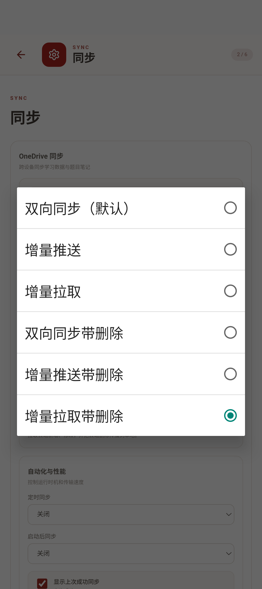

# 考研学习空间 · NPEE Study Space

考研学习空间是一款本地优先、无需注册的考研题库、错题复盘与学习进度工具。它把数学二、2004–2026 英语一、机械原理、机械设计与南航 851 历年真题放进同一套学习流程，并提供多轮复习、题目笔记、手写演算、学习记录和 OneDrive 多端同步。

当前正式版：**v0.5.9** · **23 个题库** · **7425 道题** · 提供 macOS / Windows / Android 正式下载

[下载正式版](https://github.com/EnderRayven/NPEElearningtool/releases/tag/v0.5.9) · [查看更新说明](https://github.com/EnderRayven/NPEElearningtool/releases/tag/v0.5.9) · [反馈问题](https://github.com/EnderRayven/NPEElearningtool/issues)

> 本公开仓库是正式版发布门户：`main` 只保留面向用户的介绍与截图，可安装或可运行的正式版统一通过 [Releases](https://github.com/EnderRayven/NPEElearningtool/releases) 发布。开发、测试、本地数据、备份和日志不进入公开分支或正式版下载包。

## 功能一览

以下截图均来自正式应用界面，可以点击图片查看原图。

<table>
<tr>
<td> 英语真题：年份、题型、原文与全卷导航</td>
<td> 数学与专业课：原题、解析图和状态筛选</td>
<td> 英语错题：题型与具体错误选项记录</td>
</tr>
<tr>
<td> 题目笔记：Markdown 文字与矢量手写</td>
<td> 分次复习：初始标记、结果与复习间隔</td>
<td> 学习看板：日历、正确率与层级进度</td>
</tr>
<tr>
<td> 设置与数据：轮次、同步、导入和备份</td>
<td> 导出打印：按范围筛选并生成练习材料</td>
<td> 题目编辑：文字、题图和解析图维护</td>
</tr>
<tr>
<td> 工具箱：计时器、笔记与草稿入口</td>
<td> 计时器：秒表、倒计时与快捷预设</td>
<td> 草稿本：独立画布、套索、缩放与改色</td>
</tr>
</table>

## 题库学习

### 英语一历年真题

- 收录 2004–2026 年英语一真题，按年份、Section、题型和阅读 Text 组织。
- 原文、题目、选项、答案解析与全卷题号导航集中在同一页面。
- 完形、阅读、新题型、翻译和写作使用对应的专用排版。
- 阅读小题共享当前篇章计时，切换题号不会丢失文章位置和计时状态。
- 可记录阅读题型及具体错误选项，复盘时能直接看到错误来源。

### 数学与专业课图片题

- 数学二、机械原理、机械设计和南航 851 真题按题库、章节、小节和题号导航。
- 支持扫描题、讲义截图、一题多图、多张答案图和文字解析。
- 顶部与底部均可切换上下题，长题看完后无需滚回页面顶部。
- 题号颜色对应当前熟练度，支持未标记、熟练、生疏、错误和卡住筛选。
- 图片按原始比例展示，适合保留公式、机构图、受力图和复杂排版。

## 掌握状态与多轮复习

- 全学科统一使用“熟练、生疏、错误、卡住”四级熟练度。
- 生疏、错误和卡住可继续多选知识、方法、识别、计算、审题、粗心、速度等二级卡点。
- 第一次判断保存为初始标记，后续复习按第 1 次、第 2 次依次形成独立时间线。
- 每次复习显示结果、时间、距初始标记和距上次复习的间隔。
- 待复盘入口自动汇总生疏、错误和卡住题；达到熟练后自动退出当前复盘列表。
- 学习轮次彼此隔离，可以保留一刷、二刷和后续轮次的完整记录。

## 题目笔记与手写演算

- 每道题拥有独立的文字笔记和矢量手写笔记，切换题库或轮次不会串题。
- 文字笔记支持 Markdown，适合记录公式、易错点、解题顺序和复习提醒。
- 手写支持画笔、橡皮、撤销、重做、直线、箭头、矩形、圆形与三角形。
- 可修改笔迹和形状的颜色、线型、填充及透明度，并支持全屏书写。
- 独立草稿本提供套索、复制粘贴、批量改色和 35%–320% 缩放，不会混入题目笔记。

| 工具箱 | 计时器 | 独立草稿本 |
| --- | --- | --- |
|  |  |  |

## 学习看板与进度追踪

- 日历按天显示练习题数、正确率、待复盘数量和涉及题库。
- 统计可继续下钻到题库、章节和小节，快速定位进度不足或错误率较高的部分。
- 同一道题当天多次调整只计一次，并以当天最终状态参与统计。
- 看板分别展示今日学习、当前轮次和整体掌握分布，长期进度不会被短期波动覆盖。
- 应用会记住数学、英语和专业课各自上次学习的位置，重新打开可直接继续。

## 题库维护、导出与备份

### 题目编辑器

- 可编辑题号、题型、考点、题干、选项、答案和文字解析。
- 支持从图片、PDF 和剪贴板导入素材，并对题图、解析图进行裁剪、旋转、替换和删除。
- 可以按题号、题干或章节搜索，用上一题和下一题连续维护整套题库。
- 题库内容与个人熟练度、笔记和复习记录分离，更新题目不会覆盖学习进度。

### 导出与打印

- 可按题库、章、节、专题、熟练度、标签、题型、年份、考点和分值筛选。
- 支持每页 1 题或 2 题，导出前显示符合条件的题数与预计页数。
- 可选择是否包含答案、解析、原文材料、题目笔记和原始图片。
- 支持浏览器打印或另存为 PDF，也可以将原图复制到指定文件夹。
- 完整备份包含题库结构、全部学习轮次、熟练度、学习记录、设置及题目笔记。

## OneDrive 多端同步

学习记录和笔记默认只保存在本机。用户主动登录 OneDrive 后，可以在桌面端和 Android 之间同步学习轮次、熟练度、复习记录、考试日期与笔记。

- 使用 OneDrive App Folder，未登录、未授权时不会上传数据。
- 支持双向同步、增量推送、增量拉取，以及对应的带删除模式。
- 文件冲突不会被静默覆盖，而是保留冲突副本供用户确认。
- 支持断网续传、限流重试和长任务检查点，移动端中断后无需全部重来。
- Android 会先读取云端题库列表，再由用户选择需要恢复的题库；未选择的题库不会下载或删除本机已有内容。

<table>
<tr>
<td align="center"> Android 同步页：云端题库列表与同步方向</td>
<td align="center"> 六种同步方向均可选择并在重启后保留</td>
</tr>
</table>

## 正式版下载

### macOS

Apple Silicon 设备下载 [NPEE-Study-Space-0.5.9-arm64-mac.dmg](https://github.com/EnderRayven/NPEElearningtool/releases/download/v0.5.9/NPEE-Study-Space-0.5.9-arm64-mac.dmg)。

当前安装包尚未使用 Apple Developer ID 签名。首次打开如被系统拦截，请在 Finder 中右键应用并选择“打开”。

### Windows

- [Windows x64 安装版](https://github.com/EnderRayven/NPEElearningtool/releases/download/v0.5.9/NPEE-Study-Space-Setup-0.5.9.exe)
- [Windows x64 便携版](https://github.com/EnderRayven/NPEElearningtool/releases/download/v0.5.9/NPEE-Study-Space-0.5.9.exe)

### Android

- [Android Release APK](https://github.com/EnderRayven/NPEElearningtool/releases/download/v0.5.9/NPEE-Study-Space-0.5.9-release.apk)
- [Android SHA-256 校验文件](https://github.com/EnderRayven/NPEElearningtool/releases/download/v0.5.9/NPEE-Study-Space-v0.5.9-Android-SHA256SUMS.txt)

当前 Android Release APK 为便于覆盖升级既有版本，继续使用同一 Android 验收密钥签名；它不是应用商店长期发布签名。公开下载区只提供 Release 构建。

题库数据分包与所有公开下载文件均可在 [v0.5.9 Release](https://github.com/EnderRayven/NPEElearningtool/releases/tag/v0.5.9) 中找到，并附带 SHA-256 校验文件。旧 Web Software.zip 因含开发源码已下架，不再作为正式版发布。

## v0.5.9 更新亮点

- 新增南航 851 历年真题，覆盖 20 个初试与复试年份/场次、211 道题。
- 完善 Android OneDrive 云端题库清单、选择性恢复、分组续传和检查点恢复。
- 恢复 Android 同步方向选择，可使用全部 6 种同步策略并持久保存。
- 优化熟练度、二级卡点、学习记录、题目笔记和多端紧凑布局。
- 修复桌面端真题图片加载、学习记录滚动和复合下拉点击区域问题。
- 修复 Android 切换到暂无题库的专业课模块时残留上一模块题目的问题。

## 数据与隐私

- 学习记录、题目笔记、个人笔记、备份和日志默认只保存在用户设备中。
- 桌面安装包、Android APK 与公开题库包均不包含任何用户数据。
- OneDrive 仅在用户主动登录并选择同步后使用；未授权时不会上传数据。
- 普通双向同步默认不传播删除，发生冲突时会保留冲突副本供用户处理。
- 题库内容与个人学习记录分开保存，替换或更新题库不会覆盖熟练度与复习历史。

## 项目链接

- [最新正式版](https://github.com/EnderRayven/NPEElearningtool/releases/latest)
- [全部版本与更新记录](https://github.com/EnderRayven/NPEElearningtool/releases)
- [问题与建议](https://github.com/EnderRayven/NPEElearningtool/issues)
